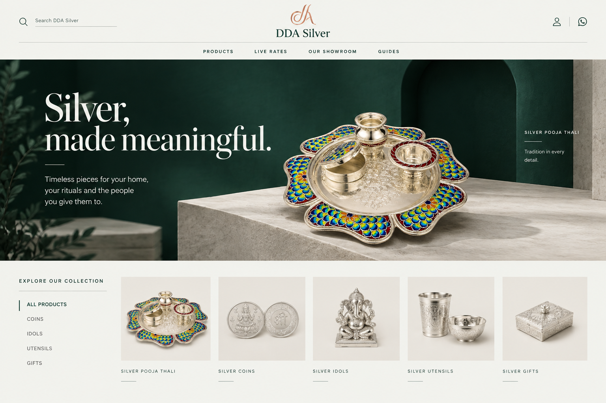
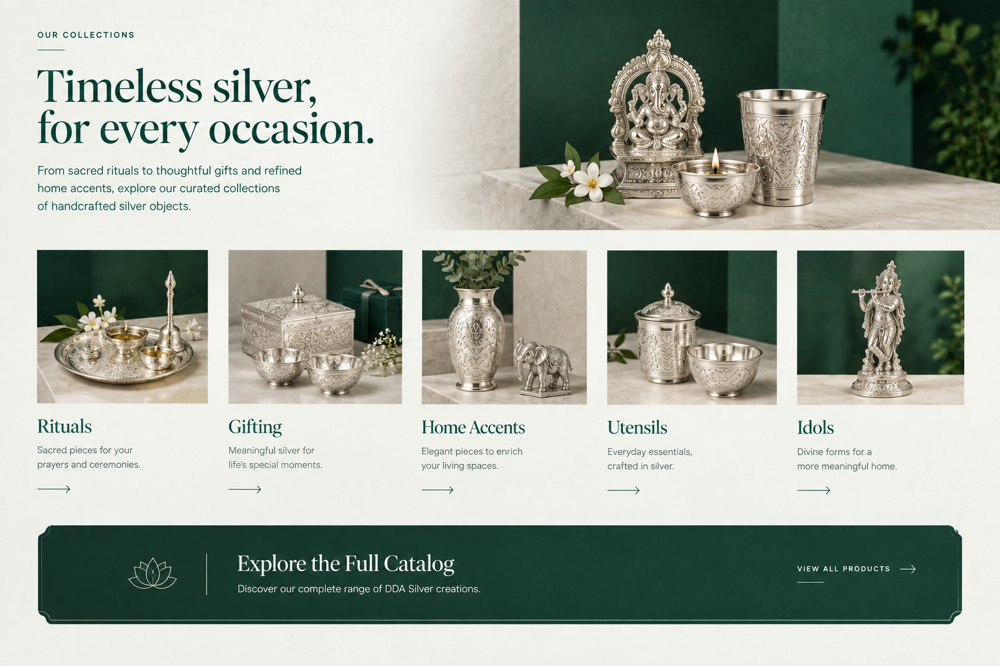
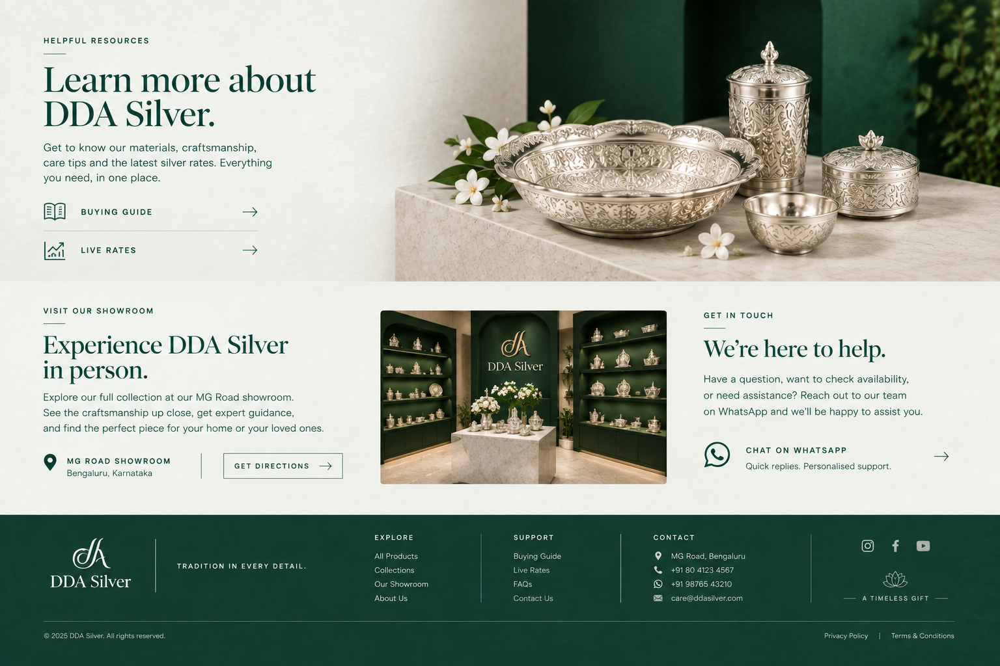
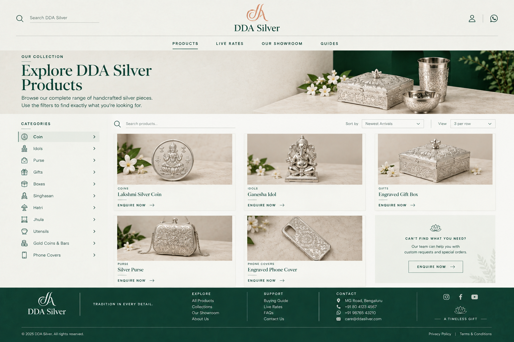
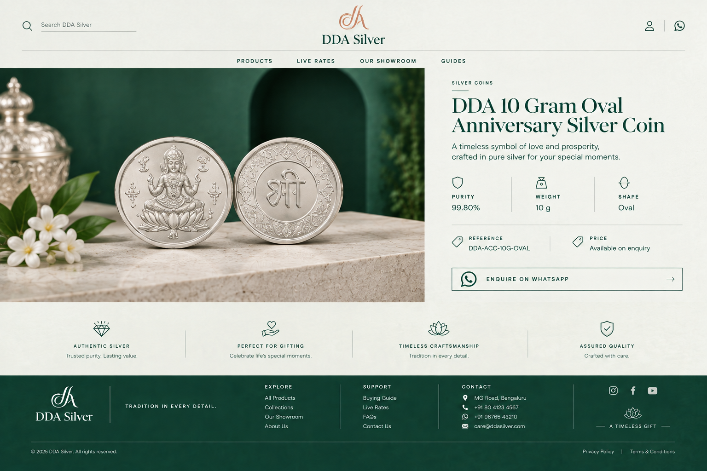
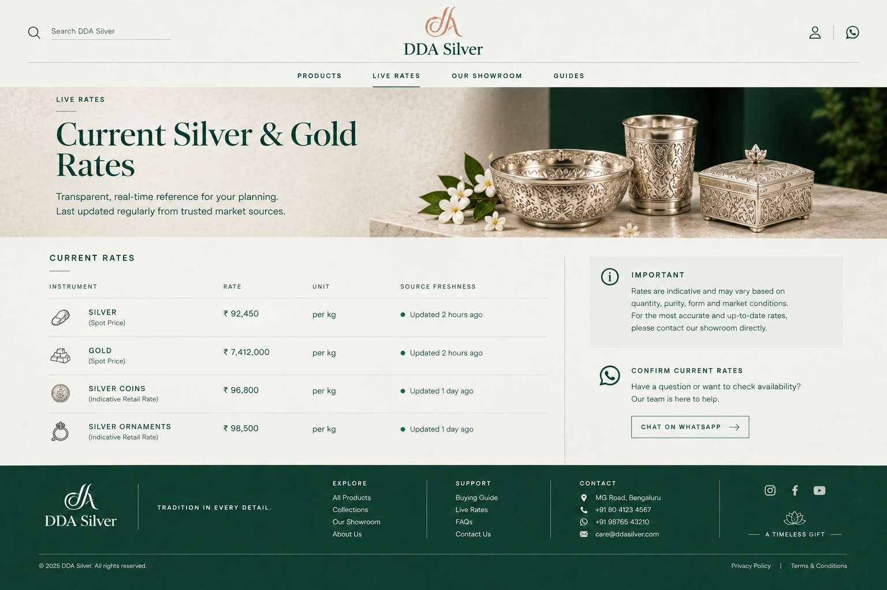
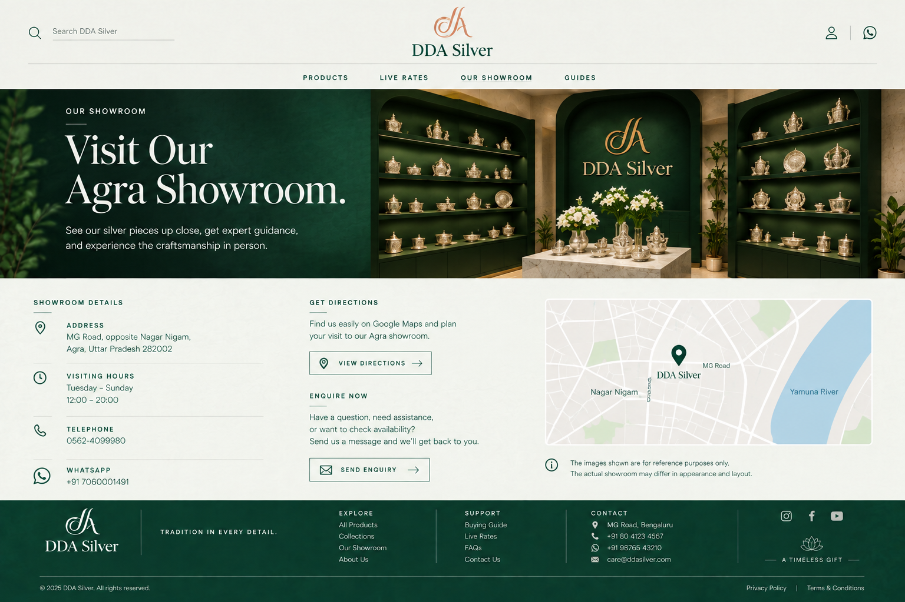
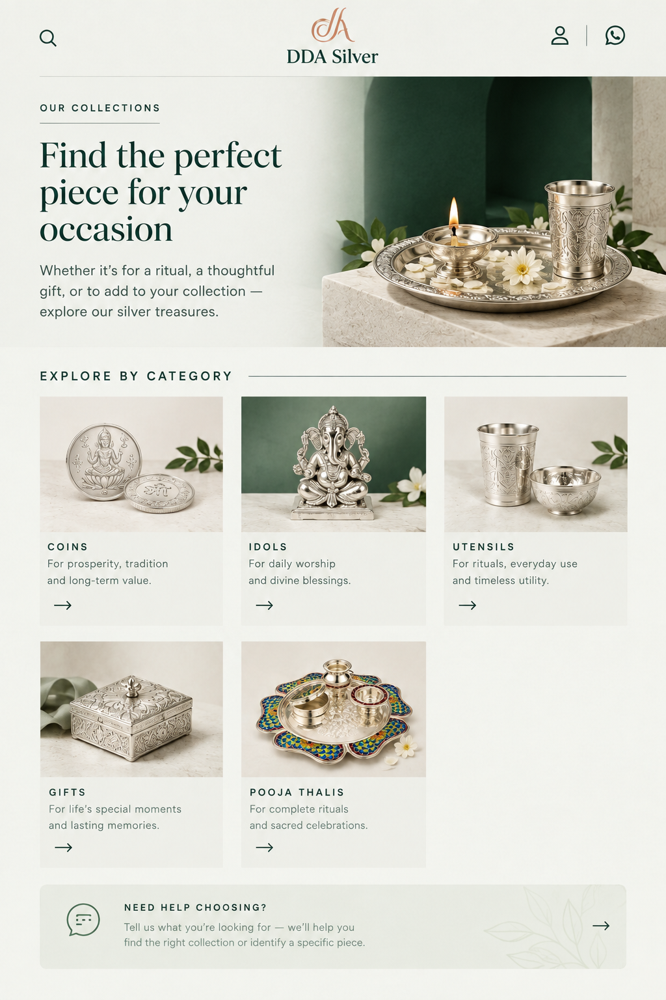
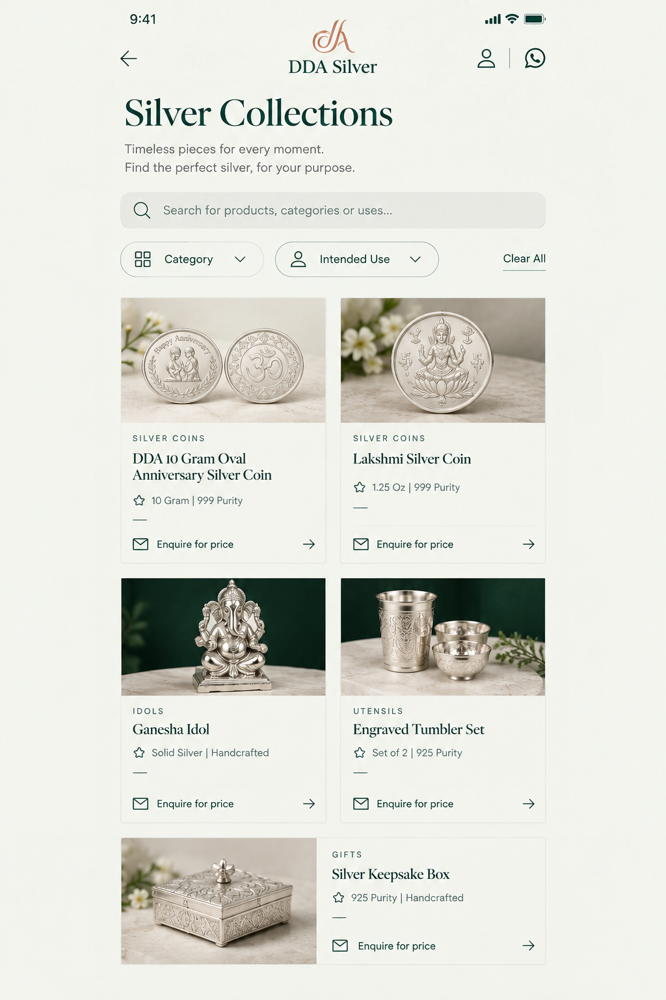

# DDA Silver — “The Silver House” concept set

> **Current selection: Homepage B, chosen by the user.** [Open selected B](draft-run/candidates/B.png). This supersedes the C recommendation described in the historical generation notes below. Existing desktop and portrait branches were generated from C and have not yet been adapted to B. The selection covers the visual direction; use real brand/product assets and an enquiry action in place of B's unsupported bag icon.

This folder contains generated design concepts for the proposed full redesign. The proposed visual direction is **Candidate C** from the fresh four-candidate draft: centered DDA masthead, midnight green and mineral white, editorial serif typography, and a vertical category index. This is a design recommendation, not a user-approved design or production-ready content.

The desktop and mobile branches retain the selected visual language, but their generated imagery and copy are not reliable records of DDA Silver’s catalog or business details. Use these PNGs to assess layout, hierarchy, color, and visual atmosphere. Do not publish them or implement their displayed content without replacing and verifying it against the source of truth.

## Fresh direction candidates

The four distinct first-pass concepts are in [`draft-run/candidates`](draft-run/candidates/). Candidate C is the proposed direction; A, B, and D remain alternate concepts. These candidates are independent design explorations, not approved assets.

## Desktop screens

Run `crt-c586f713403c2343e9af848c424bab69e196581e` completed successfully with six screens. Screens A and B are homepage continuation screens; C is catalog, D is the anniversary-coin detail concept, E is live rates, and F is showroom/contact.

| Screen | Concept | Image | Review status |
|---|---|---|---|
| A | Home continuation — collections | [a.png](branch-desktop/branch/screens/a.png) | Layout concept; product staging is generated. |
| B | Home continuation — resources, showroom, contact | [b.png](branch-desktop/branch/screens/b.png) | **Reject displayed contact data:** footer shows Bengaluru and invented phone/email; showroom image is generated. |
| C | Product catalog | [c.png](branch-desktop/branch/screens/c.png) | **Reject displayed footer contact data:** Bengaluru and invented phone/email. Product cards/images are generated examples, not verified live inventory. The sidebar names all 11 intended categories. |
| D | DDA 10 Gram Oval Anniversary Silver Coin detail | [d.png](branch-desktop/branch/screens/d.png) | **Reject displayed product image and reference:** visual shows round Lakshmi coins rather than the oval anniversary coin, and reference is fabricated. Footer contact is also wrong. Price-on-enquiry is appropriate. Claims below the product (for example, “trusted purity” and “assured quality”) need factual review. |
| E | Live rates | [e.png](branch-desktop/branch/screens/e.png) | **Reject factual content:** fabricated rate amounts and “updated” timestamps directly contradict the required unavailable-data state. Footer contact is also wrong. |
| F | Our showroom | [f.png](branch-desktop/branch/screens/f.png) | Agra address, hours, telephone, and WhatsApp in the main contact area match the brief. Showroom rendering/map are illustrative. **Reject footer contact data:** Bengaluru and invented phone/email. |

### Desktop previews

## Mobile screens

Run `crt-b2b30376407ede765902cb5083420d1f6c611356` is **partial**. It produced screens A and B, then stopped because the 12ui service reported that the free generation allowance was exhausted and the prepaid wallet needed more balance. Slots C–E were not generated; there was no retry.

| Screen | Concept | Image | Review status |
|---|---|---|---|
| A | Home collections continuation | [a.png](branch-mobile/branch/screens/a.png) | Layout concept; category “Pooja Thalis” and product staging need mapping to the verified catalog. |
| B | Silver Collections listing | [b.png](branch-mobile/branch/screens/b.png) | **Reject factual content:** anniversary coin image is round rather than oval; purity is shown as 999 instead of the verified 99.80%; card names, images, weights, purities, and “Handcrafted” descriptors are generated/unverified. |
| C | Collections continuation | Not generated | Service allowance exhausted. |
| D | Anniversary coin detail | Not generated | Service allowance exhausted. |
| E | Live silver rates | Not generated | Service allowance exhausted. |

## Source and integrity notes

- The design language is documented in [`docs/design/redesign-2026-09-12/design-language.md`](../../../docs/design/redesign-2026-09-12/design-language.md). The briefs and CLI run metadata remain in their original locations alongside the PNGs.
- Generated product imagery is illustrative and is not pixel-accurate DDA inventory photography. Replace it with the matching, approved real product assets before any production use; do not infer details from the generated renders.
- The verified anniversary-coin facts available for this concept are: **DDA 10 Gram Oval Anniversary Silver Coin**, oval, 10 g, 99.80% purity. Price is confirmed on enquiry. The generated desktop detail gets the displayed purity/weight/shape close but changes the object and invents the reference; the generated mobile listing changes both the object and purity.
- The live-rate concept must show an honest unavailable state and no numeric quote until a current verified source and timestamp are supplied. The generated desktop rate page fails this requirement and is rejected for its displayed values and freshness claims.
- Correct showroom details for eventual content replacement are: MG Road, opposite Nagar Nigam, Agra, Uttar Pradesh 282002; Tuesday–Sunday, 12:00–20:00; 0562-4099980; WhatsApp +91 7060001491.
- No application source was changed, no Sanity writes were made, and no HTML prototype was generated.
