# DDA Silver website experience audit

**Date:** 30 July 2026  
**Surface:** Local DDA Silver website  
**Viewports:** 1440 × 1000 desktop and 390 × 844 mobile  
**Primary user goal:** Discover silver products, inspect a design, and contact the showroom or check rates.

## Overall verdict

The visual system is polished, distinctive, and consistent across desktop and mobile. The catalog search and product-detail enquiry path work well. The largest problems are content readiness and defensive empty states: the homepage promotes categories that currently contain no products, the featured-products area renders as a large blank section, live rates are unavailable, and internal launch-copy is visible on the Contact page.

These issues make a strong-looking site feel unfinished at exactly the points where users expect proof, product breadth, and current business information.

## Step health

| Step | Experience | Health |
| --- | --- | --- |
| 1 | First desktop visit and cookie choice | Needs attention — strong hero, but the consent panel covers a large part of the first screen and the featured area is empty. |
| 2 | Browse all products | Healthy — clear hierarchy, strong photography treatment, usable search and filters. |
| 3 | Search for a specific design | Healthy — results update immediately, the count changes, and Clear filters appears. |
| 4 | Inspect a product and enquire | Healthy on desktop; needs mobile conversion polish — the desktop CTA is clear, while the mobile CTA sits well below the first screen. |
| 5 | Check live rates | Blocked by data — the safe unavailable state works, but the page is dominated by dashes and has no visible page title or next action. |
| 6 | Contact the showroom | Needs launch cleanup — contact actions are clear, but internal “required before launch” copy is visible. |
| 7 | Use the site on mobile | Good foundation — responsive layouts and large targets work; the catalog is vertically expensive and the menu does not close with Escape. |
| 8 | Browse a promoted category | Poor — Jewellery is promoted on the homepage but opens to zero products, and the empty-state copy incorrectly suggests changing filters. |

## Captured flow

### 1. Homepage, desktop

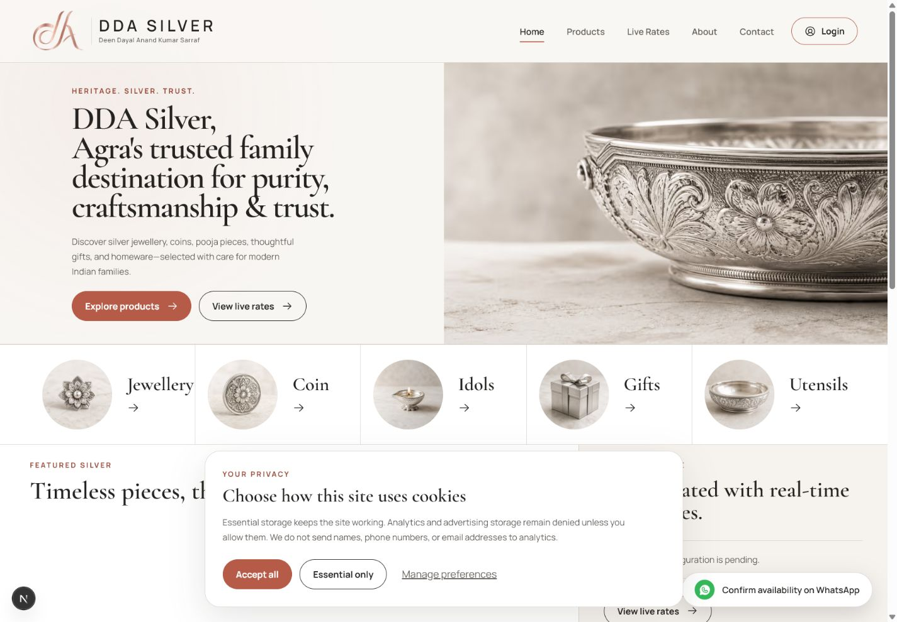

Strengths:

- Premium visual identity, clear product-discovery and rates CTAs, and legible navigation.
- Category shortcuts are easy to scan.
- The cookie panel gives Accept all, Essential only, and Manage preferences comparable prominence.

Issues:

- The blank Featured silver area consumes a large part of the page because the current catalog has no featured items.
- The cookie panel obscures the rate teaser and part of the first content transition.
- The site promises jewellery, idols, gifts, and utensils before those categories contain public products.

### 2. Product catalog

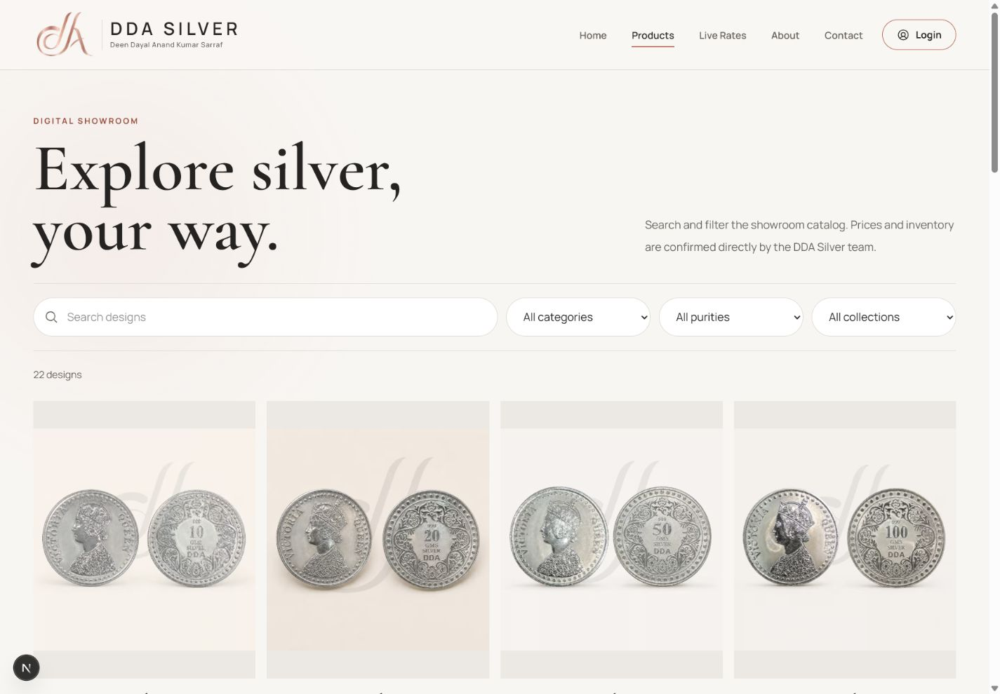

The catalog is one of the strongest parts of the site. The title, supporting copy, controls, result count, and four-column grid form a clear sequence.

The current collection facet contains only “All collections,” so it adds visual and interaction cost without offering a choice. Empty or single-option facets should not render.

### 3. Search results

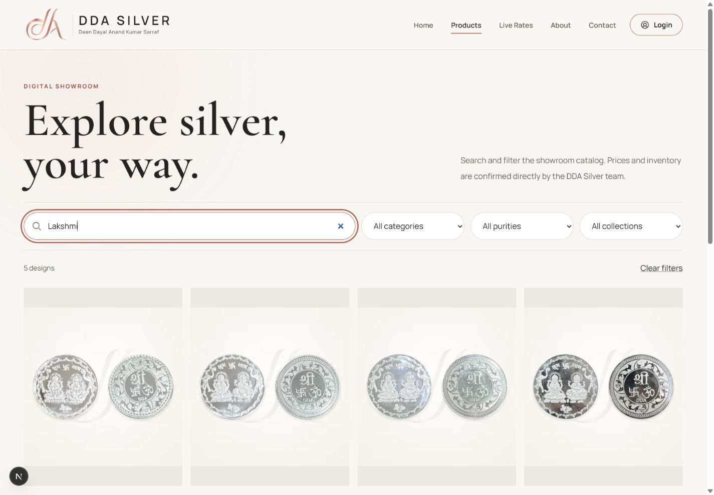

The search state is clear and responsive. The result count changes from 22 to 5 and Clear filters becomes available. The visible focus treatment is also strong.

### 4. Product detail

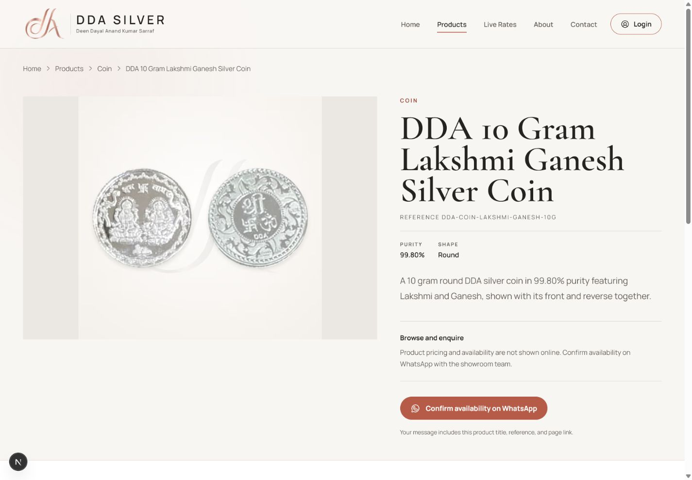

The desktop detail page has a clear image/title split, useful breadcrumb, reference and purity information, and an unambiguous WhatsApp enquiry CTA.

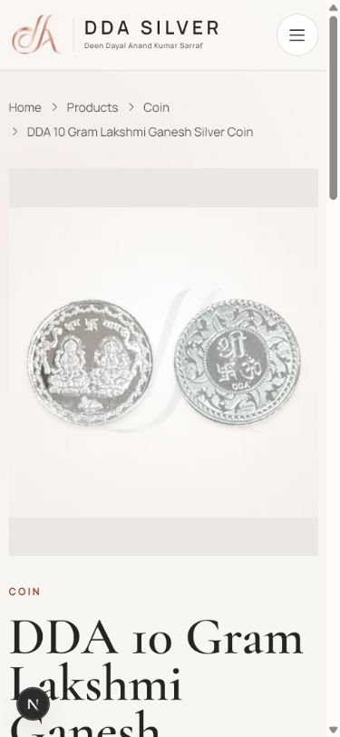

On mobile, the large image, wrapped breadcrumb, and very large multi-line title push the enquiry action far below the first screen. A sticky bottom enquiry action or a more compact title/media treatment would reduce conversion friction.

### 5. Live rates

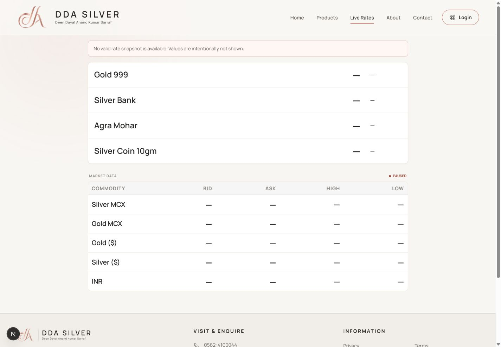

The page fails safely by not fabricating values, which is the correct trust decision. The experience still needs a better unavailable state:

- show a visible page title and plain explanation;
- add last successful update when available;
- offer “Call/WhatsApp for today’s rate” as the recovery action;
- distinguish connection setup, temporary outage, and closed-market states.

### 6. Contact

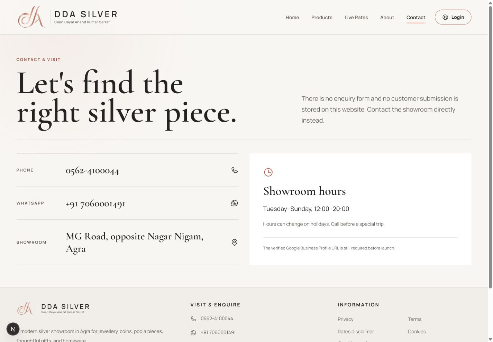

The phone, WhatsApp, address, and hours are easy to scan. The line “The verified Google Business Profile URL is still required before launch” is internal project language and should never appear to customers. Hide the block until the verified link exists, or replace it with an approved public message.

### 7. Mobile homepage and menu

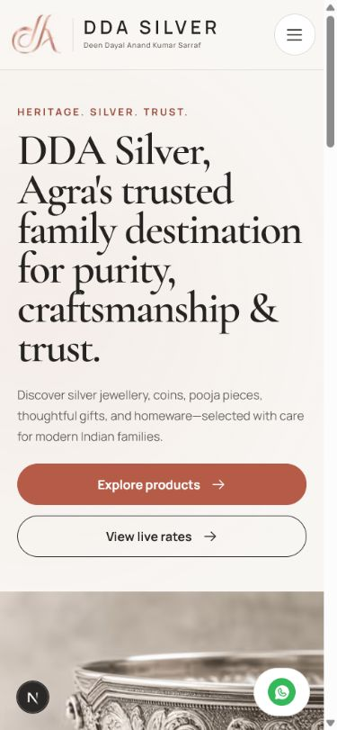

The mobile homepage retains the brand hierarchy, readable hero, and 48-pixel-scale actions well.

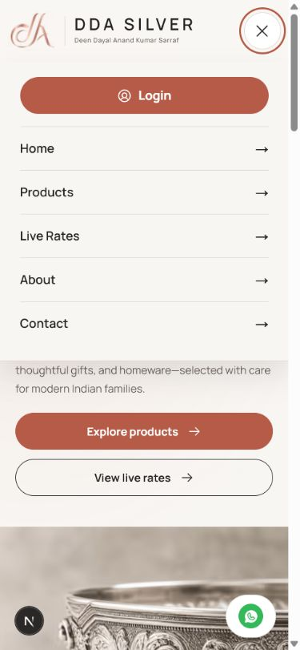

The menu has good target sizes and labels. Keyboard testing confirmed that pressing Escape leaves the menu open. Add Escape handling, focus movement into the menu, focus restoration to the trigger, and protection from tabbing into covered page content.

### 8. Mobile catalog

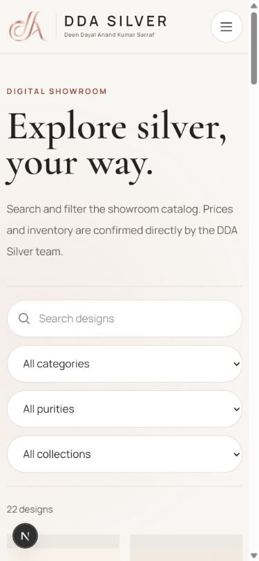

Search and four stacked selectors consume nearly the entire first screen, so no product is visible without scrolling. Keep search visible, but collapse secondary filters into a Filters button/sheet and hide unavailable facets such as Collections.

### 9. Promoted empty category

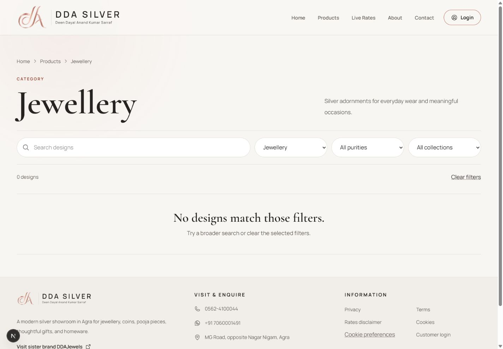

This is the highest-impact content problem. A homepage category shortcut leads to zero products, yet the empty state says “Try a broader search or clear the selected filters.” The user did not make a mistake—the category is empty.

Until the catalog is populated:

- show only categories containing published products; or
- use a category-specific “Collection coming soon—ask us on WhatsApp” state; and
- prevent Sanity publishing or launch approval when promoted categories are empty.

## Prioritized improvements

### P1 — fix before owner launch review

1. Populate the non-coin catalog or hide empty category shortcuts and filters.
2. Make the homepage Featured silver block conditional, with a CMS rule requiring a minimum featured set before it is shown.
3. Remove internal setup/launch copy from customer-facing pages and add the verified business profile/map destination.
4. Connect and verify the live-rate feed; make the unavailable state useful even when the feed is down.
5. Replace concept/mockup imagery with approved product and showroom photography to support the trust promise.

### P2 — improve discovery and conversion

1. Collapse secondary mobile filters and show products earlier.
2. Add a persistent mobile WhatsApp enquiry action on product-detail pages.
3. Add Escape and focus management to the mobile menu.
4. Reduce the first-visit consent panel’s footprint without weakening choice.
5. Add a compact trust strip using only approved facts, such as family heritage, showroom location, and verified purity/craft information.

### P3 — operational safeguards

1. Validate `NEXT_PUBLIC_SITE_URL` in preview/production so shared product enquiry messages never contain a localhost URL.
2. Add automated content checks for zero promoted categories, zero featured products, missing verified business links, and placeholder/mockup assets.
3. Add monitoring for rate-feed availability and surface a meaningful recovery message when it fails.

## Accessibility notes

Confirmed strengths in this run include a skip link, semantic headings and landmarks, labelled form controls, descriptive product-image alternatives, visible focus styling, large mobile targets, live result-count announcements, and reduced-motion handling in the implementation.

Risks needing follow-up:

- Mobile navigation does not close on Escape and does not manage focus.
- The cookie prompt is announced as a non-modal dialog while visually covering a large part of the page; keyboard and screen-reader behavior should be tested as a complete flow.
- The unavailable rates page relies heavily on visual table structure and dash values; the visible recovery message and next action should be clearer.

## Evidence limits

- No WhatsApp message, phone call, login, or other external action was submitted.
- The live-rate backend and shared-account login were unavailable, so recovery states were audited rather than successful authenticated/live states.
- This was a screenshot, DOM, interaction, code, and console review of the local site. It was not a full WCAG conformance audit, screen-reader certification, production performance test, or legal/content approval.
- The browser console showed no warnings or errors during the audited flow.

