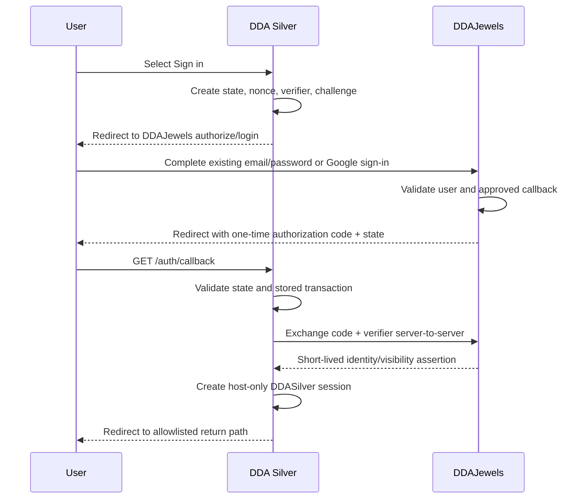

# Shared-account authentication

**Status:** Approved experience; DDAJewels authorization endpoints are proposed  
**Account authority:** DDAJewels

## Requirements

- Preserve every existing DDA account.
- Keep passwords and Google authentication on DDAJewels.
- Use the same account identity with separate host-only sessions on each root
  domain.
- Support personalized-rate visibility only.
- Do not add a DDASilver member profile, signup, or password-reset workflow.

## Flow



## Proposed authorization contract

### Authorization start

DDASilver redirects to a DDAJewels authorization endpoint with:

- `client_id=ddasilver`
- Exact `redirect_uri`
- Random `state`
- Random `nonce`
- PKCE `code_challenge`
- `code_challenge_method=S256`
- Optional allowlisted DDASilver return path stored server-side, not trusted
  from the callback

If the user has no DDAJewels session, DDAJewels displays its existing login and
Google sign-in experience. Signup and recovery links remain on DDAJewels.

### Authorization code

- Opaque.
- One-time.
- Short lifetime, recommended 60 seconds or less.
- Bound to client, redirect URI, nonce, and PKCE challenge.
- Stored hashed if server-side persistence is required.
- Never written to application logs or analytics.

### Token/code exchange

Server-to-server only. The response should contain the minimum data needed to
create a DDASilver session:

```ts
type DDAIdentityAssertion = {
  subject: string;
  issuedAt: number;
  expiresAt: number;
  rateVisibilityVersion: string;
  displayName?: string;
};
```

Do not return password metadata, provider tokens, Google credentials, or
unnecessary profile fields.

## DDASilver session

- Host-only cookie for DDASilver.
- `HttpOnly`.
- `Secure` outside local development.
- `SameSite=Lax`.
- Path `/`.
- Persistent device session: elapsed time or inactivity alone does not require
  login again.
- Renewable 400-day browser-cookie transport horizon; successful authoritative
  session checks renew the same host-only cookie without replacing the server
  session.
- Signed and/or encrypted with a DDASilver-specific secret.
- Rotated after login and privilege changes.

The cookie name must use a secure production prefix where supported. Local
development uses a separate non-production name.

## Callback handling

The callback must:

1. Require a matching unexpired login transaction.
2. Compare state in constant time where appropriate.
3. Use the stored verifier; never accept one from the URL.
4. Exchange the code once.
5. Validate issuer, audience/client, nonce, issuance, and expiry.
6. Delete the login transaction whether success or failure.
7. Reject external return URLs.
8. Create the DDASilver session only after complete validation.
9. Redirect to a safe same-origin path.

Failures show a generic retry page and do not reveal whether an email or user
exists.

## Logout

- POST only.
- Protected against cross-site request forgery.
- Deletes the DDASilver session.
- Does not assume it can delete the DDAJewels cookie.
- May offer a separate explicit link to sign out of DDAJewels, but does not
  silently perform a global logout.

## Personalized stream ticket

The DDASilver server uses the current session to request a rate ticket from
DDAJewels. DDAJewels re-evaluates current visibility rather than trusting
client-supplied roles.

Recommended response:

```ts
type StreamTicketResponse = {
  ticket: string;
  expiresAt: string;
  view: string;
};
```

The browser holds the ticket in memory only. It is excluded from analytics,
breadcrumbs, error reports, and referrers. Reconnect requests a new ticket
through the authenticated same-origin endpoint.

## Abuse and security controls

- Exact callback allowlist.
- Exact client registration.
- PKCE, state, and nonce.
- Short code and ticket expiries.
- Single-use code and replay-limited ticket.
- Rate limits for login start, callback failure, exchange, and ticket minting.
- No open redirects.
- No secrets in URL query parameters other than the short-lived opaque code or
  ticket required by the protocol.
- Audit logs record event class, result, client, and coarse time—not credentials
  or tokens.
- Session invalidation when DDAJewels disables the account or changes
  visibility.
- Explicit DDA Silver logout revokes the authoritative shared session and
  deletes the local host-only cookie.

## Required tests

- Valid email/password handoff.
- Valid Google handoff.
- Existing DDA account preserved.
- Already-signed-in DDAJewels user.
- Expired, replayed, or altered code.
- Missing or altered state.
- Incorrect PKCE verifier.
- Disallowed callback or return URL.
- Exchange timeout and safe retry.
- Disabled account.
- Logout and CSRF rejection.
- Expired/replayed stream ticket.
- Visibility change during an active DDASilver session.
