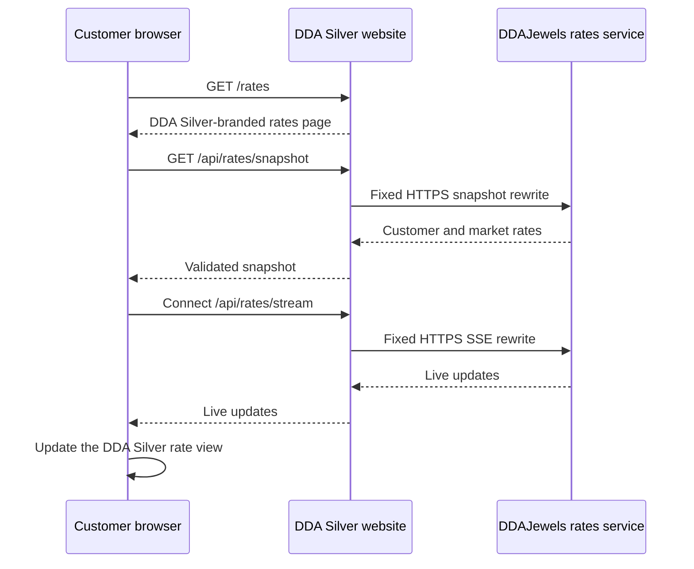

# Live-rates integration

**Status:** DDA Silver page and protected Preview integration implemented;
production configuration pending approval
**Source of truth:** DDAJewels

## Customer experience

Every customer-facing “Live Rates” link remains on DDA Silver and opens
`/rates`. The page uses the DDA Silver site header, footer, typography, colour
tokens, spacing, and responsive templates.

DDAJewels remains authoritative for rate values, market state, account
approval, and personalized visibility. DDA Silver validates and presents those
values but never calculates, fabricates, or silently substitutes them. A
missing value is shown as unavailable rather than zero.

## Data flow



## Required configuration

```text
DDAJEWELS_RATES_SNAPSHOT_URL=https://ddajewels.com/api/v1/rates/current
DDAJEWELS_RATES_STREAM_URL=https://ddajewels.com/sse/rates
DDAJEWELS_RATE_TICKET_URL=
DDAJEWELS_SERVICE_TOKEN=
```

Only the two fixed HTTPS `ddajewels.com` paths above are accepted. Next.js
rewrites them behind same-origin DDA Silver paths so browsers remain on the DDA
Silver origin and do not require a cross-origin exception. The browser receives
no service token. Personalized streams use a short-lived opaque ticket issued
by the server-side ticket route.

## Page behavior

- Customer and market-reference rows follow the approved deterministic order.
- Movement is conveyed by an icon and accessible label, not colour alone.
- Market rows expose expandable high and low values.
- Valid snapshots remain visible during brief reconnects.
- Stale, disconnected, and unavailable states are explicit.
- Unknown schemas and malformed or oversized payloads are rejected.
- Mobile tables fit the viewport and disclosure controls remain
  keyboard-operable.

## Health and launch operations

The DDA Silver `/api/health` endpoint checks the website application and Sanity
configuration. Rate connectivity is verified separately against an approved
DDAJewels staging environment before launch.

Setting production rate endpoints, deploying either application to Production,
or changing DNS still requires explicit production approval.
