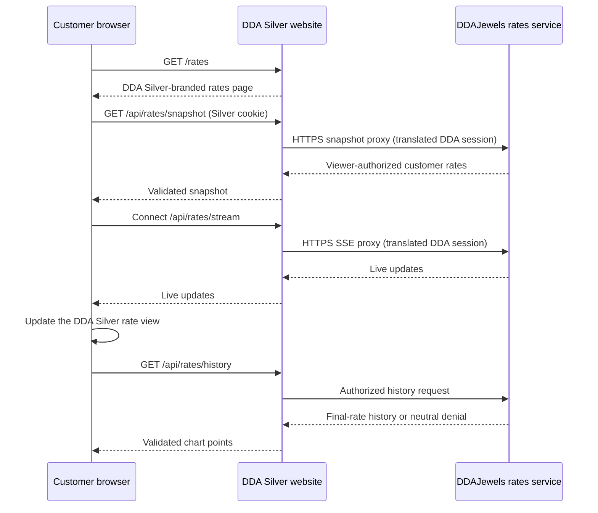

# Live-rates integration

**Status:** DDA Silver page and protected Preview integration implemented;
production configuration pending approval
**Source of truth:** DDAJewels

## Customer experience

Every customer-facing “Live Rates” link remains on DDA Silver and opens
`/rates`. The page uses the DDA Silver site header, footer, typography, colour
tokens, spacing, and responsive templates.

DDAJewels remains authoritative for rate values, market state, account
approval, and personalized visibility. DDA Silver validates and presents those
values but never calculates, fabricates, or silently substitutes them. A
missing value is shown as unavailable rather than zero.

## Data flow



## Required configuration

```text
DDAJEWELS_RATES_SNAPSHOT_URL=https://ddajewels.com/api/v1/rates/current
DDAJEWELS_RATES_STREAM_URL=https://ddajewels.com/sse/rates
```

Only fixed HTTPS `ddajewels.com` hosts are accepted. Next.js route handlers
proxy them behind same-origin DDA Silver paths so browsers remain on the DDA
Silver origin and do not require a cross-origin exception. For signed-in
customers, the server translates the separate DDA Silver cookie to the regular
DDAJewels session cookie accepted by the authoritative rate service. The
session value is never exposed to browser JavaScript or placed in a URL.

## Page behavior

### Public HTML reference snapshot

The rates route also renders a small anonymous snapshot in its initial HTML.
`src/lib/rates/public-snapshot.ts` deliberately does not use the authenticated
proxy, request headers, cookies, or an incoming `view` parameter. It requests
the configured DDAJewels origin's fixed `/api/v1/rates/current` endpoint with
credentials omitted and redirects rejected. Only `view: default`, a live feed,
and timestamps within 90 seconds (at most 30 seconds ahead) are accepted.

The upstream response has a 15-second cache lifetime and a 3-second timeout.
The route waits for an incoming request before checking freshness, so a build
cannot freeze a historical rate into the page. The explicit public item-ID
and unit allowlist must be reviewed if DDAJewels changes its public feed.
Only names, units, timestamps and public final values are serialized; buying
rates, premiums, sources and other private fields are dropped. Browser-rendered
snapshot figures disappear when their timestamp reaches 90 seconds old.
Closed, stale, malformed or unavailable feeds show an unavailable message.

The existing live, session-aware experience remains separate. Reference values
are not product offers or final retail quotations.

- Customer and market-reference rows follow the complete server-authorized
  item set and deterministic upstream order.
- Approved customers can drag, move, hide, restore, and reset rows. New items
  authorized later are appended without reviving no-longer-authorized items.
- Chart controls appear only for approved, verified customers with chart
  permission. DDAJewels rechecks group and item visibility for every request.
- Movement is conveyed by an icon and accessible label, not colour alone.
- Market rows expose expandable high and low values.
- Valid snapshots remain visible during brief reconnects.
- Stale, disconnected, and unavailable states are explicit.
- Unknown schemas and malformed or oversized payloads are rejected.
- Mobile tables fit the viewport and disclosure controls remain
  keyboard-operable.

## Health and launch operations

The DDA Silver `/api/health` endpoint checks the website application and Sanity
configuration. Rate connectivity is verified separately against an approved
DDAJewels staging environment before launch.

Setting production rate endpoints, deploying either application to Production,
or changing DNS still requires explicit production approval.
