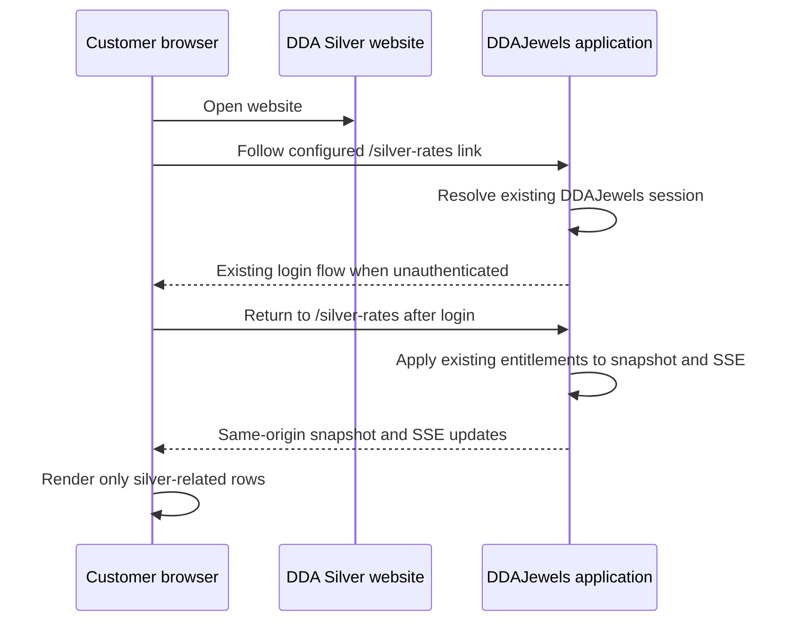

# Live-rates portal integration

**Status:** Simplified same-origin experience implemented
**Source of truth:** DDAJewels

## Active customer experience

DDA Silver does not host, proxy, frame, or reproduce the live-rates
application. Every customer-facing “Live Rates” link resolves through the
public environment variable:

```text
NEXT_PUBLIC_RATES_PORTAL_URL=https://ddajewels.com/silver-rates
```

The value is accepted only when it uses HTTPS, is hosted on `ddajewels.com` or
one of its subdomains, and targets `/silver-rates` without credentials, query
parameters, or a fragment. Missing or invalid configuration falls back to the
retained local `/rates` scaffold rather than navigating to an untrusted site.

The destination is a DDA Silver-branded route inside the DDAJewels
application. DDAJewels owns:

- user sign-in and the safe post-login return to `/silver-rates`;
- sessions, approval state, group entitlements, and buying-rate visibility;
- the current rate snapshot and same-origin SSE connection;
- silver-only presentation after the authorized rate set has been resolved.

No iframe, cross-domain OAuth exchange, CORS allowance, service-token exposure,
or rate-stream ticket is required for this path.

## Data flow



## Health and operations

The DDA Silver `/api/health` endpoint checks the website application and Sanity
configuration only. The rates portal is an outbound destination and is not a
critical dependency of the DDA Silver runtime health response.

Setting or changing `NEXT_PUBLIC_RATES_PORTAL_URL` in a production environment,
deploying either application, or changing DNS still requires explicit
production approval.

## Retained legacy scaffold

The existing DDA Silver `/rates` page, snapshot/SSE client contracts,
`/api/rates/ticket`, and shared-account authorization scaffold remain in the
repository. Primary navigation no longer depends on them, but they must not be
removed until repository evidence proves they are unused and removal is
covered by focused tests.
