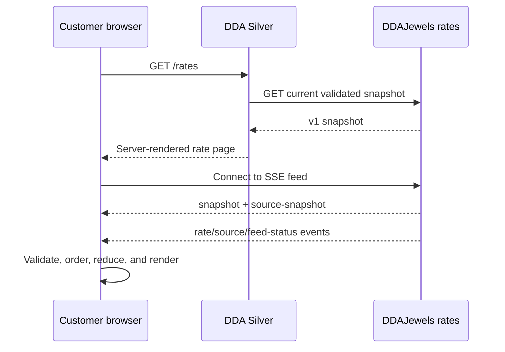

# Live-rates integration

**Status:** Public behavior locked; backend additions are proposed contracts  
**Source of truth:** DDAJewels

## Required customer experience

The DDA Silver rates page uses its own selected visual system but matches
DDAJewels data and behavior.

### Customer rows

1. Gold 999
2. Silver Bank
3. Agra Mohar
4. Silver Coin 10gm

### Market rows

1. Silver MCX
2. Gold MCX
3. Gold ($)
4. Silver ($)
5. INR

Market rows expose bid, ask, high, and low. The high/low presentation may be
collapsed on constrained screens but remains accessible through a unique,
keyboard-operable expansion control.

## Data flow



Catalog/Sanity failures must not affect the live rate stream, and rate failures
must not take down the catalog.

## Initial snapshot contract

The existing v1 current response should be extended additively so server
rendering can receive customer and market values in one validated response.

```ts
type RateSnapshotV1 = {
  schemaVersion: 1
  view: "default" | "tv" | string
  serverTime: string
  sequence: number
  items: CustomerRateItem[]
  sources: MarketSource[]
  feedStatus: FeedStatus
}
```

Existing fields must retain their current meaning. New additive fields must not
break current DDAJewels consumers.

```ts
type CustomerRateItem = {
  itemId: string
  name: string
  unit: string
  finalRate: number
  movementValue: number
  movementDirection: "UP" | "DOWN" | "FLAT"
}

type MarketSource = {
  sourceId: string
  name: string
  unit: string
  sortOrder: number
  bid: number | null
  ask: number | null
  high: number | null
  low: number | null
  sourceTimestamp: string | null
  calculatedAt: string | null
  sourceState?: {
    freshness: string
    flags: string[]
  }
}
```

Null means unavailable. It must never be converted to zero.

## SSE events

Continue supporting:

- `snapshot`: complete customer-rate snapshot.
- `rate`: incremental customer-rate updates.
- `source-snapshot`: complete market-source snapshot.
- `source`: incremental market-source updates.
- `feed-status`: connection and market-state metadata.

Every payload must include `schemaVersion: 1`. Unknown additive fields are
ignored. Unknown schema versions or malformed payloads are rejected without
replacing the last valid state.

## Client state rules

- Initial server snapshot becomes the first render.
- A full SSE snapshot may replace it only after validation.
- Incremental rate events are accepted only when their sequence is newer than
  the current sequence.
- Updates merge by stable `itemId` or `sourceId`, never by display position.
- Sort order comes from server data, with the locked product/market order used
  only as a deterministic fallback.
- The page records last valid event time independently from server market time.
- Reconnect uses bounded exponential backoff with jitter.
- A reconnect requests a fresh full snapshot before relying on increments.
- Multiple tabs should share one connection where the existing DDAJewels
  BroadcastChannel behavior can be reused safely.

## Status and failure behavior

Suggested UI states:

```text
connecting -> live -> delayed -> reconnecting -> unavailable
```

- **Connecting:** no valid live connection yet; server snapshot may remain
  visible.
- **Live:** valid events arrive inside the backend-defined freshness window.
- **Delayed:** last valid values remain visible with a clear delayed timestamp.
- **Reconnecting:** connection lost and automatic recovery is active.
- **Unavailable:** no valid snapshot exists; show dashes and explanatory copy.

Do not clear valid values during a short reconnect. Do not present stale values
as live. Do not expose exception traces or provider names to customers.

## CORS and preview origins

DDAJewels must return explicit CORS headers for approved DDASilver origins on:

- Current snapshot.
- SSE stream.
- SSE check.
- SSE acknowledgement.
- Personalized stream-ticket exchange where browser access is required.

Allow:

- One stable DDASilver Vercel preview origin.
- `https://ddasilver.com` only after launch authorization.
- `https://www.ddasilver.com` only after launch authorization.

Do not echo arbitrary origins. Preflight behavior must be covered by contract
tests. Public rate requests do not require cookies.

## Personalized rates

An authenticated DDASilver server requests a short-lived opaque stream ticket
from DDAJewels. The ticket:

- Is tied to an existing authorized DDA user and rate view.
- Contains no readable personal data.
- Is rate-stream scoped.
- Expires quickly.
- Is single-use or replay-limited.
- Is renewed through an authenticated DDASilver endpoint.

The browser connects directly to DDAJewels with the ticket. DDAJewels remains
authoritative for which rates or details the user may see.

## Formatting

- Customer rupee values use Indian grouping.
- International market values preserve appropriate decimals.
- Movement direction is conveyed by text/symbol and color, never color alone.
- Units are available to assistive technology even if visually condensed.
- Rate ticks do not steal focus or trigger excessive screen-reader
  announcements.

## Contract monitoring

Automated monitoring should verify:

- Snapshot status, latency, and schema.
- Receipt of each expected SSE event family.
- Sequence progression.
- Source/customer identifiers.
- CORS behavior from preview and production test origins.
- Personalized ticket rejection when expired or replayed.

