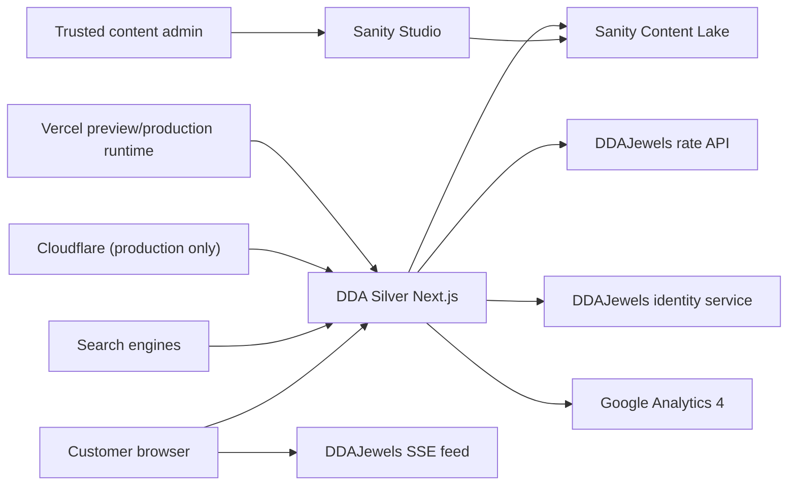

# Technical architecture

**Status:** Approved target architecture  
**Implementation:** Web application and safe integration boundaries
implemented; external staging connectivity remains

## System context



## Runtime choices

- Next.js App Router and TypeScript.
- Server Components for content and initial rate rendering.
- Client Components only for interactions such as filters, consent, image
  galleries, live SSE updates, and session-aware controls.
- Tailwind CSS plus CSS-variable design tokens.
- Sanity Studio and Content Lake.
- Vercel for preview and production runtime.
- Cloudflare DNS/proxy only during an explicitly approved cutover.
- A pinned package-manager lockfile and supported LTS Node.js version.

No generic UI theme may supersede the selected design direction.

## Proposed repository shape

```text
app/
├── (site)/
├── api/
├── auth/
├── products/
├── category/
├── collections/
└── rates/
components/
├── catalog/
├── consent/
├── layout/
├── rates/
└── ui/
lib/
├── analytics/
├── auth/
├── rates/
├── sanity/
└── seo/
sanity/
├── schemaTypes/
└── structure/
tests/
├── contract/
├── e2e/
├── fixtures/
└── unit/
```

The exact `src/` prefix is an implementation convention, not a product
decision.

## Rendering and data access

### Sanity content

- Fetch published content on the server.
- Use generated Sanity types for query results.
- Enable Sanity CDN reads for published content.
- Use a server-only token and draft perspective for preview mode.
- Revalidate only affected routes after a signed Sanity webhook.
- If Sanity is temporarily unavailable, render a controlled error or a
  previously cached published response; never expose draft tokens or raw errors.

### Rates

- Server-render a validated initial snapshot from DDAJewels.
- Connect the browser directly to the public SSE feed after hydration.
- Use a short-lived personalized ticket for authenticated streams.
- Keep catalog/content caching independent from rate freshness.
- Never cache a live rate response as static page content.

## Environment model

Expected variable names:

```text
NEXT_PUBLIC_SITE_URL
NEXT_PUBLIC_SITE_ENV
NEXT_PUBLIC_GA_ID
NEXT_PUBLIC_SANITY_PROJECT_ID
NEXT_PUBLIC_SANITY_DATASET
SANITY_API_READ_TOKEN
SANITY_PREVIEW_SECRET
SANITY_REVALIDATE_SECRET
DDAJEWELS_RATES_SNAPSHOT_URL
DDAJEWELS_RATES_STREAM_URL
DDAJEWELS_RATE_TICKET_URL
DDAJEWELS_SERVICE_TOKEN
DDAJEWELS_AUTH_AUTHORIZE_URL
DDAJEWELS_AUTH_TOKEN_URL
DDAJEWELS_AUTH_CLIENT_ID
DDAJEWELS_AUTH_CLIENT_SECRET
AUTH_COOKIE_SECRET
```

Actual secret values must exist only in local ignored files or deployment
secret stores. Preview and production values must be separate.

## Preview isolation

- Preview is publicly reachable only through an unlisted Vercel URL.
- Every preview response sends `X-Robots-Tag: noindex, nofollow`.
- Preview `robots.txt` disallows all crawling.
- Preview canonical URLs must not point to `ddasilver.com`.
- Preview analytics should use a separate GA property or remain disabled until
  explicitly configured.
- The stable preview origin must be separately allowlisted in DDAJewels CORS
  and auth callback configuration.

## Security boundaries

- Sanity draft tokens are server-only.
- DDAJewels client secrets are server-only.
- Customer passwords are entered only on DDAJewels.
- DDASilver stores only its own opaque or signed session cookie.
- Auth codes are one-time, short-lived, and bound to state, nonce, PKCE, and an
  exact callback.
- Personalized stream tickets are short-lived, rate-scoped, and replay
  resistant.
- Logs must exclude authorization codes, stream tickets, cookies, passwords,
  emails, and customer identifiers.
- Security headers must include a deliberate CSP, HSTS in production,
  `Referrer-Policy`, `X-Content-Type-Options`, and clickjacking protection.

The CSP must explicitly allow required Sanity images, DDAJewels rate
connections, Google consented analytics, maps, WhatsApp, and app-store links
without using a broad wildcard.

## Operational health

Expose a non-sensitive health endpoint that verifies:

- The application process responds.
- Sanity configuration is present.
- DDAJewels snapshot connectivity succeeds within a short timeout.
- Build/version metadata is available.

The health endpoint must not report secrets, user information, internal
database details, or current personalized rates.

`/api/health` implements this contract. It returns a degraded `503` when a
configured dependency is unavailable or when required preview integrations are
not configured, and it never returns rate values or credentials.
