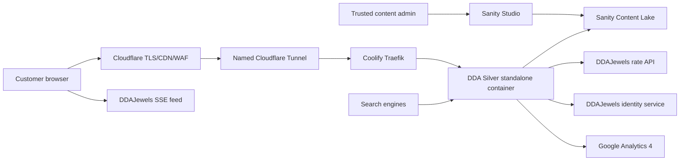

# Technical architecture

**Status:** Production architecture

**Implementation:** Oracle Coolify origin behind an outbound-only Cloudflare
Tunnel

## System context



## Runtime choices

- Next.js App Router and TypeScript.
- Server Components for content and initial rate rendering.
- Client Components only for interactions such as filters, consent, image
  galleries, live SSE updates, and session-aware controls.
- Tailwind CSS plus CSS-variable design tokens.
- Sanity Studio and Content Lake.
- An ARM64 Next.js standalone container on Oracle `coolify-a1`, managed by
  Coolify and reached through Traefik on internal port `3000`.
- Cloudflare DNS, proxy, TLS/WAF, and named Tunnel
  `61e8ad96-2e1a-4e4f-b82c-7dbecac951e5` as the only public request path.
- A pinned npm lockfile and Node.js 24.19 runtime.

No generic UI theme may supersede the selected design direction.

## Proposed repository shape

```text
app/
├── (site)/
├── api/
├── auth/
├── products/
├── category/
├── collections/
└── rates/
components/
├── catalog/
├── consent/
├── layout/
├── rates/
└── ui/
lib/
├── analytics/
├── auth/
├── rates/
├── sanity/
└── seo/
sanity/
├── schemaTypes/
└── structure/
tests/
├── contract/
├── e2e/
├── fixtures/
└── unit/
```

The exact `src/` prefix is an implementation convention, not a product
decision.

## Rendering and data access

### Sanity content

- Fetch published content on the server.
- Use generated Sanity types for query results.
- Enable Sanity CDN reads for published content.
- Use a server-only token and draft perspective for preview mode.
- Revalidate only affected routes after a signed Sanity webhook.
- If Sanity is temporarily unavailable, render a controlled error or a
  previously cached published response; never expose draft tokens or raw errors.

### Rates

- Server-render a validated initial snapshot from DDAJewels.
- Connect the browser directly to the public SSE feed after hydration.
- Use a short-lived personalized ticket for authenticated streams.
- Keep catalog/content caching independent from rate freshness.
- Never cache a live rate response as static page content.

## Environment model

Expected variable names:

```text
NEXT_PUBLIC_SITE_URL
NEXT_PUBLIC_SITE_ENV
NEXT_PUBLIC_GA_ID
NEXT_PUBLIC_SANITY_PROJECT_ID
NEXT_PUBLIC_SANITY_DATASET
SANITY_API_READ_TOKEN
SANITY_PREVIEW_SECRET
SANITY_REVALIDATE_SECRET
DDAJEWELS_RATES_SNAPSHOT_URL
DDAJEWELS_RATES_STREAM_URL
DDAJEWELS_RATE_TICKET_URL
DDAJEWELS_SERVICE_TOKEN
DDAJEWELS_AUTH_AUTHORIZE_URL
DDAJEWELS_AUTH_TOKEN_URL
DDAJEWELS_AUTH_CLIENT_ID
DDAJEWELS_AUTH_CLIENT_SECRET
AUTH_COOKIE_SECRET
```

Actual secret values exist only in ignored local files or deployment secret
stores. Coolify owns active production values. Public Next.js variables are
available at build and runtime; Sanity revalidation, DDAJewels, and cookie
credentials are runtime-only. `AUTH_COOKIE_SECRET` must remain stable across
Coolify releases so existing sessions are not invalidated.

## Deployment and release isolation

- `main` is deployed only by the GitHub Actions Coolify webhook workflow after
  `npm run check` passes.
- Coolify repository auto-deploy is disabled to prevent duplicate releases.
- GitHub calls the deploy-only Coolify API through the exact tunnel match
  `coolify-deploy.kartikeyagarwal.com/api/v1/deploy`; other paths on that
  hostname return 404, while the panel remains behind Cloudflare Access.
- `SOURCE_COMMIT` is supplied to the Docker build and becomes
  `NEXT_DEPLOYMENT_ID` and the health endpoint's `APP_VERSION`.
- On shutdown the container reports `checks.application: "draining"`, waits
  eight seconds for Traefik's active health checks to remove the backend, and
  only then stops Next.js. The normal health response remains unchanged.
- The application remains single-instance and has no persistent filesystem,
  distributed cache, or Redis dependency.

The production cutover completed on 2026-08-25. Cloudflare Tunnel is the only
website origin path; direct OCI ports `80`, `443`, and `8000` were verified
unreachable and already absent from the attached security-list ingress rules.
The temporary validation route has been removed. The former Vercel project and
its account-level `ddasilver.com` domain registration were deleted after
cutover validation, so rollback uses a retained Coolify image or reverted Git
commit without changing DNS.

## Security boundaries

- Sanity draft tokens are server-only.
- DDAJewels client secrets are server-only.
- Customer passwords are entered only on DDAJewels.
- DDASilver stores only its own opaque or signed session cookie.
- Auth codes are one-time, short-lived, and bound to state, nonce, PKCE, and an
  exact callback.
- Personalized stream tickets are short-lived, rate-scoped, and replay
  resistant.
- Logs must exclude authorization codes, stream tickets, cookies, passwords,
  emails, and customer identifiers.
- Security headers must include a deliberate CSP, HSTS in production,
  `Referrer-Policy`, `X-Content-Type-Options`, and clickjacking protection.

The CSP must explicitly allow required Sanity images, DDAJewels rate
connections, Google consented analytics, maps, WhatsApp, and app-store links
without using a broad wildcard.

## Operational health

Expose a non-sensitive health endpoint that verifies:

- The application process responds.
- Sanity configuration is present.
- Build/version metadata is available.

The health endpoint must not report secrets, user information, internal
database details, or current personalized rates.

`/api/health` implements this contract. It returns a degraded `503` when
Sanity's required public configuration is absent and never returns rate values
or credentials. Its version priority is `APP_VERSION`, `SOURCE_COMMIT`, then
the package version.

See [Oracle Coolify production deployment](oracle-coolify-deployment.md) for
the network path, environment ownership, release procedure, and rollback.
